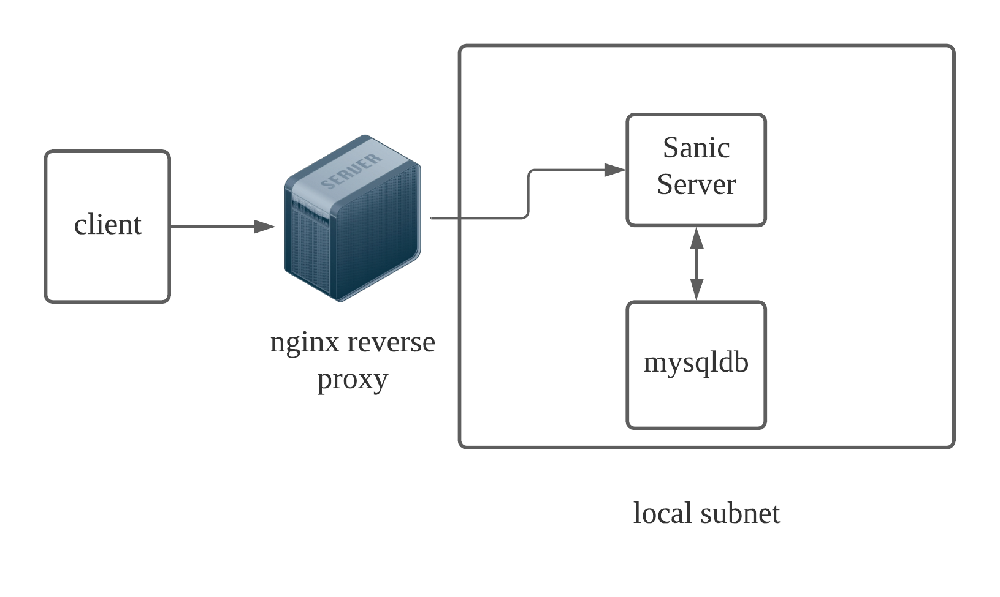

# link_shortener

Intro:
-------
 - Simple link shortener that will return a shortened link
 - If called with the shortened link, server will redirect to the provided link
 - App contains a nginx reverse proxy, an api layer and a database




### Running app

  ```make start``` to bring the containers up


 Call ```172.16.238.20:80/link?link=yourlinkhere.com``` to generate the link


  Call ```172.16.238.20:80/<generated_link>``` to get the link redirect

